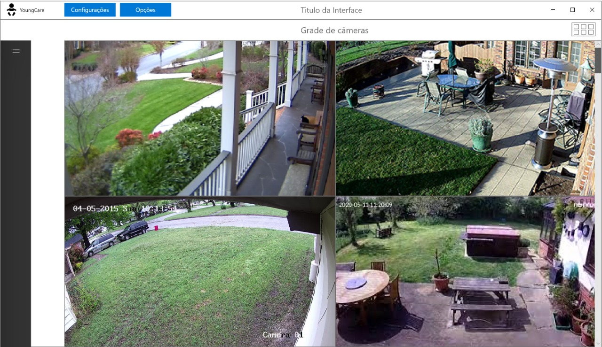

# Interface Project

  This is a interface project of a software designed at Faculdade de Tecnologia de Americana in human machine interface (HMI) subject
  (Interface Homem Máquina - IHC, in portuguese). The project has been designed by a group of 4 students.

 
## Young Care

  The software we think about, provides parents the hability of watching their kids while working in situations like home office, especially in those
  quarantine days. For that, is necessary the installation of cameras to record the rooms inside the home, so the software can communicate with them
  and show what exactly is been recording in that specific time.
  Since we've started thinking about the project, one of our worries is bringing to the parents a user-friendly experience, a lot of softwares like this
  one aren't friendly and are too dificult to use, being apropriate only to persons that work professionaly with it.

  
## Low-Fidelity Prototype

## Storyboard Prototype

## Some Mockups
### Main Screen 

### Add New Camera

### User Login

## License
This project is released under MIT License. See [LICENSE](LICENSE) for more info.
